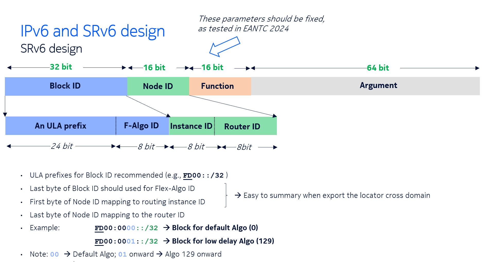
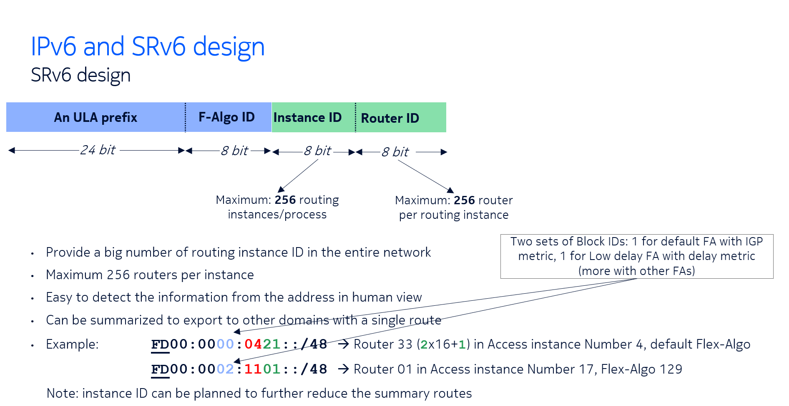
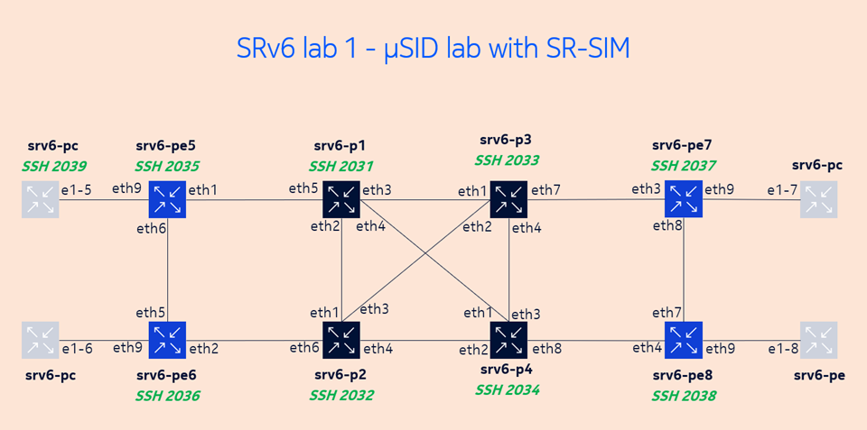
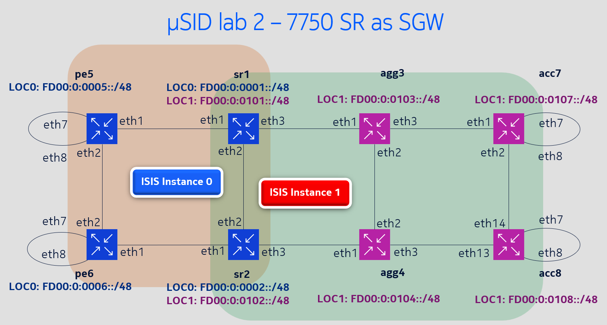
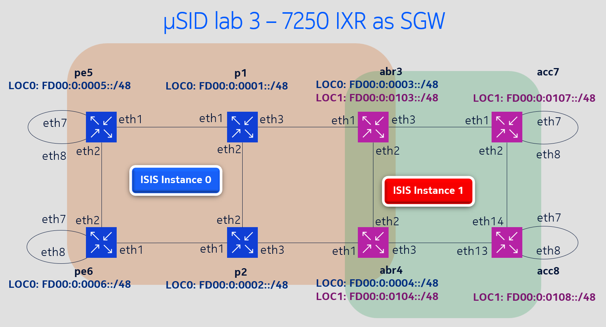
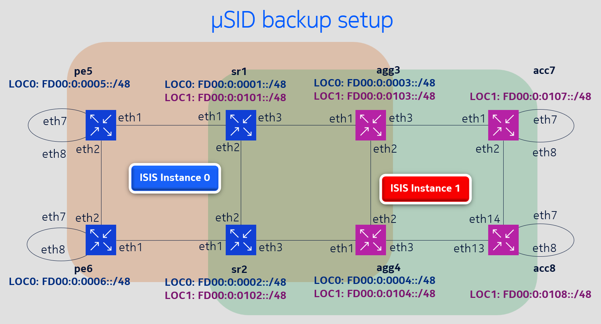

# **🚀 Containerlab for SRv6 w uSID compression**

> This repo is few containerlabs about SRv6 with uSID compression. For now, all labs are set up with Nokia SR OS router.

## 📌 Contents

- [Introduction](#-introduction)
- [Project structure](#-project-structure)
- [How to deploy](#️-how-to-deploy-the-labs)
- [Lab 1: Single IGP domain with all 7750 SR routers](#️-lab-1-single-isis-domain-all-7750-sr-routers)
- [Lab 2: 7750 SR as ABR for multi-domain](#️-lab-2-7750-sr-as-abr-for-multi-domain)
- [Lab 3: 7250 IXR as ABR for multi-domain](#️-lab-3-7250-ixr-as-abr-for-multi-domain)
- [Backup lab for mult-domain](#️-backup-lab-for-multi-domain)

---

## 📖 Introduction

This repo is few containerlabs about SRv6 with uSID compression. For now, all labs are set up with Nokia SR OS router.

1. Fist lab is the most simple one with all routers are 7750 SR residing in a single ISIS domain.

2. Other labs are multiple ISIS domain network with deviation on the logical topology as ABR can be 7750 SR or 7250 IXR.

Locators are assigned as below



---
local folder: ~/srv6-uSID/ (just for me to remember)

repository url:
https://github.com/caophuonghuy/srv6-usid-clab.git

---
Topolog

## 📂 Project structure

```to be updated
.
├── README.md
├── all-7750SR  (lab 1)
├── IXR-access  (lab 2)
├── ixr-sgw     (lab 3)
├── picture     (pictures of topo, capture screens...)
```

## ⚙️ How to deploy the labs

```bash
git clone https://github.com/caophuonghuy/srv6-usid-clab.git
cd srv6-usid-clab/
```


To deploy each lab

```bash
#
cd all-SR-routers
clab deploy -t SRv6-uSID.clab.yaml
```
or just

```bash
clab deploy
```

---

## 🛠️ Lab 1: Single ISIS domain (all 7750 SR routers)
🖼️**_Topology of single-domain lab_**


</p>
---

- 
- 
---

## 🛠️ Lab 2: 7750 SR as ABR for multi-domain

</p>

- 
- 
- 
## 🛠️ Lab 3: 7250 IXR as ABR for multi-domain


## 🛠️ Backup lab for multi-domain

</p>

---
